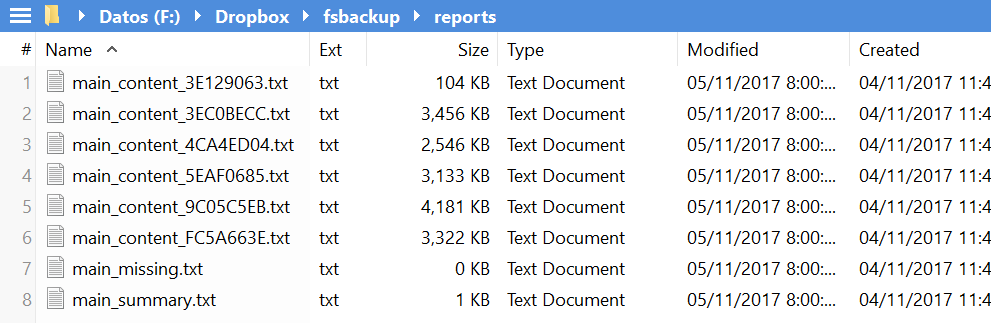

**********************
Detailed command usage
**********************
Everything works via the ``fsbck`` command. If the installation is correct, it should be available no matter what the active directory is.
In this section, the basic usage is shown, but the full detail and optional parameters can be found in :mod:`commands <fsbackup.commands>` module documentation.

Database Creation
=================
It is achieved with::
    fsbck.py createDatabase -db=<config_file>

If the database containing the two necessary collections ``files`` and ``volumes`` do not exist, they are created.
Otherwise the execution fails. If you want it rebuild, add the ``--force`` flag.

Create reports for backup status
================================
With::
    fsbck.py backupStatus -db=<config_file>

several text files are created (with different level of detail) regarding the status of the backup:

  * size and number of files in each backup volume

  * size and number of files not yet backed-up

  * size and number of files in the volumes than are no longer necessary

  * explicit list of files in each volume

An example of the files created:

.. pic_reportfiles_screenshot:

    Files created by ``backupStatus``.

Contrary to what it might seem, this operation is fairly quick.

Database ``files`` update
=========================
This command updates the database information to match the current state of the filesystem. 
If files are modified their hash is recalculated, if files were removed their entries are eliminated from
the database, and new files require new entries.

This is achieved with::

    fsbck.py refreshHashes -db=<config_file>

For large systems, the calculation of hashes is time-consuming. The first time I calculated it for my NAS it took nearly
a week. So, I prefer to perform this process dayly, in scheduled task at night, and right after it the ``backupStatus`` reports are regenerated.

Volume update
==============
This is the way content gets actually backed-up. Suppose you have a volume with available space on it, or if you are going to create
a new volume, just a formated external drive. When connected, it is assigned a drive letter, say J: [#fWin]_ . Then
to perform the update use::

    fsbck.py updateVolume -db=<config_file> --drive=J

New files are added to the volume, until it is full or all of them are processed, a text message tells which of the two.

.. warning:: Be sure that the ``files`` information is updated (via command ``refreshHashes``) before invoking a volume update. Otherwise, when the script tries to copy a file that the database is mentioning, it might not be physically there anymore, and thus exceptions would arise. There is no problem, however, if the only difference is that new files were created.

Volume clensing
================
When you remove files from your backed-up filesystem, copies of them remain in backup volumes. There is no harm in it,
just the waste of space. As time passes, the wasted space in volumes could amount to something. With::

    fsbck.py cleanVolume -db=<config_file> --drive=<driveLetter>

the files in the volume than are not shown as necessary by the database are removed.

Volume processing
===================
In the first days, when I wanted to update a volume I found myself always performing:

  1. volume clensing

  2. volume update

  3. backuptatus reports regeneration

I created a batch, but after a while I decided an additional command was in order to do it all: ``processDrive``. With::

    fsbck.py processDrive -db=<config_file> --drive=<driveLetter>

those three tasks are performed. This keeps the volumes clean of old files, the system fully updated and the status reports
reflecting the current backup status.

In a day-to-day basis this is almost the only command you need (if the ``refreshHashes`` is taken care of by an scheduled task).
Of course, you could manually run ``refreshHashes`` before processing a drive, just to make sure the database is up-to-date.

Information recovery from volumes
==================================
All the burden of keeping the filesystem updated has a single purpose: to be able to recover content from the backup volumes
when necessary. This operation may be infrequent, but it is arguably the most important. It is currently performed with the
``checkout`` command::

    fsbck.py updateVolume -db=<config_file> --drive=<driveLetter> --sourcepath=\\ZEYCUS-TVS671\Multimedia\video\seriesPlex\Monk --destpath=F:\temp\Monk

This process finds all the files in the volume that are a backup of a file in the given ``sourcepath`` (or in a subfolder),
and copies them recreating the folder structure within the path ``destpath``.

Needless to say, to recover the whole folder content you need to process all the volumes containing at least one relevant file. It is possible to see which volumes
are involved by searching the backup-status report files. Or just process them all, it takes very little time if no content is necessary.

Recalculation of Volume Information
=====================================
The operations that add and remove files from the volume in same time update the database.
So, theoretically, the database is always up-to-date. I have not found a single case in which this was not the case, 
but nevertheless implemented::

    fsbck.py extractVolumeInfo -db=<config_file> --drive=<driveLetter>

What this does is to remove from the ``volumes`` collection all the entries associated to the present volume, then
it is traversed and an entry is created for each actual file found.

Volume Integrity Check
=====================================
In case we want to make sure that a backup volume is OK, we can perform an integrity check with:
    fsbck.py integrityCheck -db=<config_file> --drive=<driveLetter>

This is a time consuming operation that actually compares each file of the volume with its counterpart in the actual filesystem
(if it was not deleted). For 3TB disks it is taking me over a day.

.. warning:: This is supposed to be done after a ``refreshHashes``. Otherwise the information in the DDBB might not reflect the actual state of the filesystem.

.. rubric:: Footnotes

.. [#fWin] I realize this is terribly Windows-oriented. For linux systems it would be rather similar, if/when Linux support is provided this documentation should be improved.