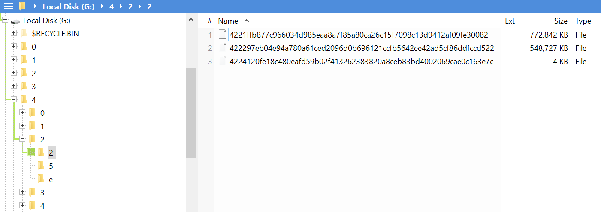

****************
Volume Content
****************

Volumes contain backups of the files in the filesystem: files with the same content. However, they are renamed with the hash of the content.
This means that no information regarding the filename in the real filesystem, or the path where it is located, can be found in the volumes (that information is stored in the ``files`` collection in the database).
All the files in the volume are placed in the root of the filesystem, but classified with their first 3 letters to avoid the problems associated with having too many files in the same folder.
An actual volume looks like this:

.. pic_volume_screenshot:

    Content of a backup volume.

